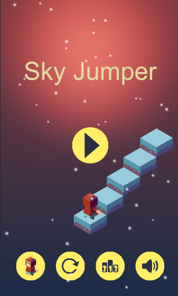
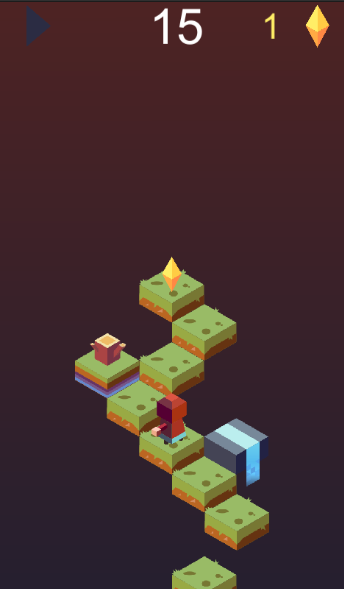
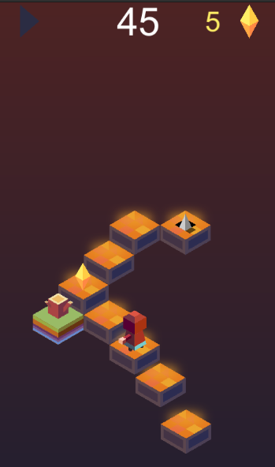
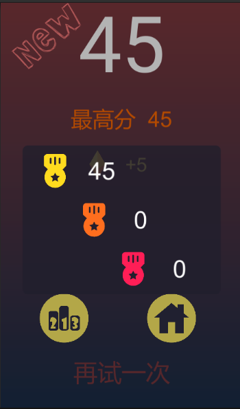

# Sky Jumper
A mobile game for Android devices utilizing the Unity and C#

## Screenshots
  ||

  ||
  
## Getting Started
1. Download and install the Unity game engine (https://unity.com/).
2. Clone or download the project from GitHub.
3. Open the project in Unity.
4. Build and run the project on your Android device.

## Built With

Unity 2019.4.40f1 - The game engine used

C# - The programming language used

## Authors
Xiangyi Zhou - https://github.com/xiangyi-zhou
## License
This project is licensed under the MIT License - see the LICENSE file for details.

